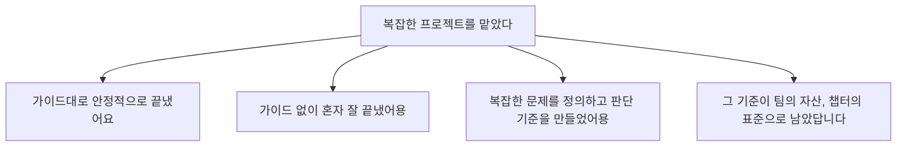

## 26년 4월 17일 저녁

사내 칭찬게시판에 메세지가 올라왔어요.


(Thx to J)

좋았는가?

Yes!

but, 좋음 이상의 ‘**안도감**’은 왜인가?

## 🤔

## 자기의심은 나의 친구

- 그 날은 제가 주도한 길드활동 미팅 날이었어요
  - 아무도 해달라고 하지 않은 일 (No title)
  - 이 미션 달성에 도움이 필요한 사람들을 반강제로 납치
- 미팅 끝나고 반추 시작 (ㅜ.ㅜㅋ) - 내가 좀 뺀질하게 퍼실리테이션(회의 진행) 했던게 아닐까? - 진정성이 얼마나 있는가? - 사람들은 왤케 조용한가? - 다들 본업으로 바쁜데 내가 덜 중요한 걸로 들쑤시고 다니는 걸까?
  
  
  자칫하면 7명의 시간 약탈자가 됨

## 불안은 도전의 찌꺼기

칭찬 하나에 안도한 이유

= 누가 시킨 일이 아닌, 내가 벌인 길을 걷고 있기 때문


하지만 이제 알아요. 불안하다는 건

= 쾌적하지 않은 새로운 길을 걷고 있어서가 아닌지


## 오늘 나눌 이야기

> 불안불안하게 옆으로 자랐더니, 썩 마음에 드는 분재가 된 이야기
> 

- 1막: 나 - 바텀업으로 가지 뻗기
- 2막: 회사 - 탑다운으로 가지 읽기
- QnA

## 발표자 소개


10년차 개발자, 6년을 토스에서

- 토스보험 2년: Individual Contributor
- 토스모바일 2년: 소그룹 리드 시작
  - 7명 규모 팀
- 토스비즈니스 2년: 소그룹 리드 안정기
  - 9명 규모 팀

지난 달부터 (Interim) 챕터 리드를 시작했어요.

- 40명 규모 팀
- 완전 얼타는 중…

---

# 1막: 나 - 가지 뻗기

## 코알못으로 시작하다

- 음악, 미술, 체육, 컴퓨터(!)를 좋아함
- 스무살에 호기롭게 컴공 입학 (NHN NEXT)
  
- F학점작렬, 제적 위기
  - 아 내가 좋아하던 컴퓨터(포토샵, 작곡프로그램, 게임쯔꾸르)랑 코딩은 다르구나
- 프론트를 만나고 S학점으로 기사회생
  - 얼레 프론트엔드 개발은 은근 비슷하네. 음미체를 조금이나마 녹일 수 있다
- 후후 나는 개자이너&디발자다! 저를 인턴으로 받아주세요
  - → 인턴 킥아웃 2회 🥹…

우짜지… 나 개발자 괜히했나?

## 코딩을 기반으로, 옆가지 뻗기

- 코딩 잘하는 개발자- 로 대나무처럼 위로 쭉쭉 올라가지 않았어요
- 두리번두리번 비틀비틀… 빛을 찾아서 옆가지를 뻗는다 (굴광성)
  

### **옆가지 1 - 디자인**

- 인턴 킥아웃 되었지만, 여전히 들고있는 개발자&디자이너 아이덴티티
  - 개발자 겸 디자이너로 핑크퐁컴퍼니 입사
  - but… 디자인도 개발도 할 수 있는 사람이자, 디자인도 개발도 1인분보다 현저히 못하는 상태 🥹
  - 가면증후군의 시작. 나는 말은 앞서지만 개발도 못하고 디자인도 못해

### **옆가지 2 - 커뮤니티**

- 제 또 하나의 특징: 사람 만나는거 좋아함
  - 주니어 개발자 커뮤니티 만듦 (9XD)
  - 2014년… 커뮤니티 가면 다 남자 아저씨만 있는 시기였음
  - 여자도 주니어도 많은 공간 운영 > 6년동안 꽤 키움 (5천명 규모, 먼슬리 밋업 - 사옥투어 및 미니세션이 대표 컨텐츠)

## 조합매직

- 상위 10%인 능력을 3개 조합하면 상위 0.1%라더군요.
  - “나는 개발 상위 50%고, 디자인 능력도 상위 50%지만, 커뮤니티 운영은 상위 10% 되는것같아”
  - 조합하면 상위 2.5% \*정확히 하려면 겹치는 모수는 빼야하지만… 히히
- 이게 통한다?
  - 9XD 커뮤니티에서는 개발 지식을 베이스로 한 여러 디자인 배너&브랜딩 함 😮
  - 다음 회사에 ‘UI/UX Oriented Frontend Engineer 겸 Community manager’로 입사 😮
    

## 🪄 옆가지를 뻗다 생긴 패시브 능력 1: 주체성


- ‘나는 다양한 시도를 좋아해 ^^’라는 자기인식
  - → 여러 쨉을 날리게 됨
- 그러다가 유효타가 몇개 들어갑니다 (10개 중 1개 정도)
  - 그게 나의 브랜딩이 됨
  - 그 때부터 그 역할은 나의 ‘담당’이 됨
  - **그러면 리더십을 자연스레 하게 됨?**
    - = Lead as verb - ‘동사’로서의 리딩
- **이미 리딩하는 사람이 리더가 된다**
  - "리더야 비켜!" 하라는 게 아님
  - 95% 상황엔 이미 리더가 있어요
    - 그 사람이 하던 걸 밀어내면? 회사 입장에서도 비효율이고, 동료들도 어느 장단에 맞춰야 할지 애매해져요
  - 그럼 어떻게 이미 리딩?
    - 아무도 맡지 않은 Grey zone을 찾기
    - 리더의 고충을 듣고, 그들이 해야 하는데 시간 없어서 못하고 있는일을 내가 돕기

### e.g. 커뮤니티, 채용 브랜딩의 주체성

**시작의 가지**

- 역시 토스에도 없군, 외부향 프론트 개발자 모임. 내가 나서줘야겠군 캬하하 ← 아무도 안시킴^\_^;
- 토스 사옥을 베이스캠프로 한 초대기반 기술모임 만듦

**하다 보니**

- 8회+의 모임. 매 회 50~100명 규모 밋업
- 토론모임 → 채용 전환율 acceptance 100%


**생긴 주체성**

- "유림이 커뮤니티 전문가지" - 내부에서 커뮤니티 관련한 이야기 나오면 담당으로 끌려가거나 자문
- “이번 모임 프론트엔드파이트클럽 형식으로 해보면 어때요?” - 사내에서 회자되는 모범사례
  
- “퍼실리테이션 101 역량 체계화” - 암묵지를 명시지화해서 유림 없이도 대외활동 진행 퀄리티바 높게 가져갈 수 있도록
  - 예시
    

### e.g. 자발적 성장 주체성

**시작의 가지**

- 나는 굳이 이 소그룹에서 기술1짱이 되어 사람들을 이끌 마음은 없어
- 사람들이 자기 개성대로, 자유롭게, 탄력을 받아 성장하는걸 돕고싶어 → 흥미로운 자발적 장치 여럿 만듦

**하다 보니**

- 재밌게, 또 새롭게! 컨텐츠 큐레이션
  - 인간극장
  - 월간리드
  - 이력서 함께쓰기
  - 올해 12월의 나 멀티버스 그리기
    
  - 영향력 넓히기 담당
    

**생긴 주체성**

- “그 고민은 한번 유림님이랑 커피챗 해볼래요?” - 리더에게 자문을 주는 역할로 추천
- “인사 감각이 쬐금 있군” - 리더십 규모 상승

## 🪄 옆가지를 뻗다 생긴 패시브 능력 2: 뿌리내림 (a.k.a 개발 물리력)


- 성공경험이 생긴다 → 더 잘하고 싶어진다
  - 흔들리지 않고 싶다 → 자연스레 더 뿌리를 내리게 된다
  - 나의 뿌리는 개발자 = 개발을 잘해야함.
- 니즈가 생기니 나서서, 실용적으로 공부하게 됨
  - 아묻따 깊은 뿌리를 내리기 (X)
  - 이쪽으로 가지를 뻗고싶다? 근데 그쪽에 뿌리가 부족해서 흔들린다? 거기로 뿌리를 자연스레 더 뻗게 된다 (O)
  - 20살 처음부터 코딩 능력 키우세요! 하면 안 하고 싶었을거임(실제로 안 함 ^^;)

### e.g 코드퀄리티 물리력

**시작의 가지**

- 그냥 코드 정리정돈을 좋아함 (집에서도 청소는 안하고 정리만 함)
- 주니어때 전 복잡한 문제해결은 좀 어렵다 느끼고(당연함. 복잡하니까) 눈에 보이는 코드 정리는 좋아했어요 (돌이켜보니 이또한 메인 가지에서 벗어나 빛이 보이는 곳으로 가지 뻗은거인듯)

**하다 보니**

- 회사에서 열린 “코드리뷰 스터디”에 참여. 왜 이 코드가 냄새가 나는가? 토론하며 강한 재미를 느낌
- 정리해서 Frontend clean code 기술발표 → 유튜브 조회수 7만
  - “음 나는 코드정리를 좋아해!”란 아이덴티티 확립
- ‘코드스멜 위키’ 를 만들어보자! 하고 멤버 4명 공개 모집
  - 팀이 커짐 → Frontend Fundamentals 사이트 생성 → 한국 프론트 개발자 국룰 문서화
- 토스 내 코드퀄리티를 수호하는 ‘Code quality committee’ 위원장을 맡아 다양한 프로젝트 수행
  - 최근은 소그룹마다 커스텀 고양이를 분양해주고, 서비스 에러율에 따라 이미지를 쏴주는 캠페인
    
    

**생긴 물리력**

- 아키텍쳐와 퀄리티를 보는 눈
- 회사 차원에서 코드 품질을 측정하고 수호하는 노하우
- 코드 퀄리티?는 유림이 지켜본다- 는 이미지 (잘한다 와는 별개일수도)

### e.g 기술 트레이드오프 설계 물리력

**시작의 가지**

- 평범한 개발 요구사항
  - 여러 계열사, 사용처가 함께 쓰는 네비게이션 바를 만들어주세요
  - 새로운 앱에 로깅 시스템을 넣어주세요
  - 쿠키 인증을 mTLS 인증서 기반으로 바꿔주세요

**하다 보니**

- ‘개발’만 하고 끝내는게 아니고, 복잡한 요구사항을 조율하는 것 자체가 재밌다
- 계열사간, 직군간 소통을 어떻게 잘하지 고민하다보니
  - 경계를 넘는 이해가 필요 (서버, 클라이언트, 데이터분석가와 같은 수준으로 대화할 수 있어야 함)
  - 모두의 중간에 껴 있는 프론트가, 크로스직군 퍼실리테이션을 제일 잘 할 수 있는 자리라는걸 깨달음


**생긴 물리력**

- 이 기술이 '누구에게' 쓰이는지 보고 설계하는 눈
- 자율과 통제의 트레이드오프
- 직군간 설계를 정렬해 서로 같은 그림을 보게 만드는 힘

## 옆가지를 뻗었더니 깊이가 따라오더라

- 선배들의 구박
  - 그렇게 코딩 아닌거에 관심 가지면 너는 ”가짜개발자“ 가 된다 😈
  - 실제로 이런 말들에 영향 많이 받았어요.
    - 나는 잘하는게 아니야, 보이는것에 사람들이 속고 있고 나를 더 잘 알게 되면 날 탈락시킬거야
- 그런데, 이렇게 뻗은 가지 하나하나가, 어느새 뿌리(실력)가 됐어요 - Learning by doing - 뿌리내리지 못한 가지는 자연탈락 - 진짜개발자가 뭐임? 나는 이렇게 뻗어진 단단한 유니크한 나무야.
  

# 2막: 회사 - 가지 읽기

> 2막에서는 저의 이야기를 더 이상 하지 않고, 제네럴하고 뾰족한 프레임으로 이야기해볼게요

_“와 이번 반기에도 고생했다… 야근도 많이하고.  
근데 내가 ‘성장’한게 맞을까?  
이게 그냥 고생인지, 새로운 성장인지 어떻게 알 수 있을까?”_

## 2막에서 할 이야기

🙅‍♀️

- 협상술 아닙니다
- 연봉협상에서만 쓰는 꼼수 아닙니다

🙆‍♀️

- 내가 한 일을 반복되는 역할, 자산으로 해석할 수 있는 ‘키워드’를 얻기
  - 어떤 일은 분명 고생했는데도 왜 애매하게 읽히는지
  - 내가 다음 레벨로 가려면 뭘 더 증명해야 하는지

## 일을 더 많이 해내서 성장하는건 중니어 레벨까지

> 거칠게 레벨링을 해볼게요.

- Lv1: 명확한 가이드를 주면 수행할 수 있다
- Lv2: 경험해본 일을 안정적으로 수행한다
- Lv3: 가이드 없이 내 일을 계획하고 완결한다

…흠 OK. 여기까진 가넝

- Lv4: 복잡한 문제에서 조직이 의견을 구한다
- Lv5: 집단의 문제 해결력을 상향 평준화한다
- Lv6: 내가 만든 방식이 업계의 표준이 된다

얼레리?


- Lv4는 Lv3보다 코드를 더 많이 쓰고 야근을 더 많이 하는 사람이 아님
- 레벨이 올라갈수록 변하는 건 일의 양이 아니라
  - 문제의 난이도
  - 판단의 복잡도
  - 영향 범위
  - 팀에 남긴 자산

## 어떻게 Lv3에서 Lv4, 5로 갈 수 있는가?

### 🫧 1. `Pattern` : 이벤트를 넘어 ‘패턴’으로

**Phase 1 - 이벤트**

- 큰 프로젝트를 한 번 맡았다
- 어려운 일을 한 번 잘 수습했다
- 주변에서 “이번에 고생 많았다”고 말한다

충분히 의미 있음!  
다만 아직은 “이번에 잘했다”에 가까움

**Phase 2 - 패턴**

- 비슷한 문제를 반복해서 맡는다
- 매번 결과가 난다
- 우연이 아니라 재현 가능해 보인다
  - 복잡한 퍼널? ㅇㅇ님이 잘 봄.
  - 공통 모듈? ㅇㅇ님 의견 들어보자.
  - 새로운 앱 스캐폴딩? ㅇㅇ님이 몇번 해봤어

이때부터는 역할(직책 아님!)로 읽히기 시작. 이 사람은 이 문제를 안정적으로 푸는구나.

**Phase 3 - 아이덴티티**

- 특정 문제를 넘어서, 더 큰 장르에서 사람들이 나를 떠올린다
  - 여러 직군이 얽힌 애매한 문제 정리
  - 커뮤니티 빌딩, 퍼블릭 스피킹
  - PO와 비슷한 수준의 비저닝, 결단력, 카리스마

⇒ 나다운 성장, 나의 길을 가면서 ㅇㅈ 받을 수 있다면?


**셀프체크**

- 이건 한 번의 이벤트인가, 반복된 패턴인가?
- 비슷한 문제가 다시 생겼을 때 사람들이 나를 떠올리는가?
- 나는 어떤 문제에서 신뢰받고 있는가?
- 그 신뢰가 더 큰 장르의 아이덴티티로 이어지고 있는가?

<aside>  
💡

이거 했어요-보다 ‘이런 문제가 반복될 때 제가 불려왔어요’가 쎔

</aside>

### 🫧 2. `Expertise`: 역할확장은 ‘전문성’ 기반으로

**Phase 1 - 프론트 뿐 아니라 다른 일도 해냈다**

- 도메인에서 필요해서, 원래 하던 일 밖의 일을 해냄
- 기획도 봤고, 일정도 봤고, 디자인도 봤다!
- 저 거의 PM이었어요

다만 이를 프론트엔드 개발자의 역량으로 ‘평가’해낼 수 있는가? 어려움…

**Phase 2 - 프론트 전문성으로 문제의 반경을 넓혔다**

- 이 일이 프론트엔드 개발자의 전문성을 기반으로 확장된 일인가?
- 프론트 전문성이 없었어도 똑같이 해결할 수 있었나?

| 애매하게 읽힐 수 있음   | 강하게 읽힘                                                          |
| ----------------------- | -------------------------------------------------------------------- |
| 일정 조율을 열심히 함   | 배포, 릴리즈 제약을 이해하고 안전한 전환 전략을 설계했다             |
| 디자인 빈틈을 메움      | 프론트 구조와 사용자 흐름 관점에서 UI/UX 문제를 재정의했다           |
| 여러 직군 사이에서 조율 | 네이티브, 웹뷰, 서버 레이어 구분을 이해하고 의사결정 기준을 만들었다 |

<aside>  
💡

프론트 밖으로 나간 게 아니라, 프론트 전문성으로 다룰 수 있는 문제의 반경이 넓어짐

</aside>

### 🫧 3. `Depth`: 역할확장 뿐 아니라 ‘수직적 탁월함’

**Phase 1 - 옆으로 넓어졌다**

- 원래 하던 일보다 더 넓은 일을 맡았다
- 다른 직군/팀과 엮인 일을 했다
- TF, 프로젝트 리딩을 했다

충분히 의미 있음  
버뜨 넓어졌다만으로 다음 레벨이 되는 건 아님  
→ 내 판단의 깊이가 달라졌는지는 별개의 문제이기 때문

**Phase 2 - 깊어졌다**

- 역할확장은 중요함. 그런데 수직적 탁월함도 같이 봐야 함.
- 같은 역할 안에서도 깊이는 달라짐
  - 더 복잡한 문제를 혼자 구조화한다
  - 단순 실행이 아니라, 문제의 우선순위와 경계를 판단한다
  - 일이 터졌을 때 “어떻게 처리할지”보다 “무엇이 진짜 문제인지”를 본다

| 1인분을 다하는 개발자    | 깊어진 개발자                                   |
| ------------------------ | ----------------------------------------------- |
| 기능을 안정적으로 구현함 | 예외 케이스까지 먼저 정의                       |
| QA를 꼼꼼히 함           | 리스크 기준을 세움                              |
| 장애를 빠르게 수습함     | 왜 반복되는지 근원을 찾고 재발 방지 구조를 제안 |
| 여러 팀과 협업함         | 각 팀의 제약을 이해하고, 의사결정 프레임을 만듦 |
| 일정 안에 끝냄           | 무엇을 미뤄도 되는지 기준을 세움                |

⬆️ 같은 문제를 더 높은 해상도로 봄

<aside>  
💡

옆으로 넓어지는 것, 안으로 깊어지는 것 모두 성장이지만  
다음 레벨은 보통 둘 다를 요구함

</aside>

### 🫧4. `Asset`: 자산으로 남기기

**Phase 1 - 내가 잘하고 끝**

- 내가 다 해냄
- 그리고 끝

Lv3까지는 엄청 중요함.  
가이드 없이 내 일을 완결하는 것 자체가 Lv3의 핵심이니까

근데 Lv4, 5로 갈수록 질문이 바뀜 → 팀에 어떻게 남았나요?

**Phase 2 - 내 노하우를 밖으로 꺼냄 = 참고자료화**

- 자산화는 문서 하나 썼다~가 아님
- 내 머릿속에 있던 판단 기준을 팀이 다시 쓸 수 있게 만드는 것 = 참고자료가 된다
  - 장애 대응 체크리스트를 남기고 프로세스화
  - QA 시나리오 템플릿을 만듦
  - 신규 입사자 온보딩 문서를 만듦

내 개인 역량이 팀의 역량으로 옮겨가기 시작!

**Phase 3 - 표준이 됨**

- 좋은 자산화는 팀 내 참고자료에서 끝나지 않음
  - 내 팀에서만 쓰는 팁이 아니라 챕터의 Best Practice가 된다
  - 구성원의 문제 해결력이 상향 평준화된다

<aside>  
💡

내가 잘해서 끝나면 성과  
남들도 다시 쓸 수 있으면 자산  
모두가 그 방식으로 일하게 되면 표준

</aside>

## 같은 일, 다른 프레임



- 같은 일을 해도 레벨별로 프레임이 다름
- 그래서 이력서, 셀프 평가를 쓸 때도 그냥 ‘무슨 일을 했다’로 쓰면 약할수도
  - 지금 어느 레벨의 패턴을 만들었는지 보자

## 이력서, 셀프리뷰 실전 체크

1. **이벤트를 넘어 ‘패턴’으로 `Pattern`**

> 지금 팀에서 나는 [ ] 문제가 생기면 떠올릴 수 있는 사람에 가까워지고 있다

2. **역할확장은 ‘전문성’ 기반으로 `Expertise`**

> 이 문제에서 내 프론트 전문성은 [ ] 에서 드러났다

3. **역할확장 뿐 아니라 ‘수직적 탁월함’ `Depth`**

> 이번 경험에서 나는 [ ] 라는 더 어려운 판단을 했다.

**4. 자산으로 남기기 `Asset`**

> 이 경험은 나에게서 끝나지 않고, [ ] 으로 팀에 남았다.

### 추신

1부는 제 얘기니까 참고만 한다 쳐도,

2부는 실용적으로 도움이 되어 여러분이 맘에 드는 이력을 만들고, 뿌듯한 연봉협상 되시길! 🤑

---

# Outro: 나&회사

## 분재가되


- 왼쪽으로, 오른쪽으로 가지를 뻗다 보니 **나만의 모양**이 생겼어요.
- 가지가 쓰러지지 않게 뿌리를 내리다 보니 **깊이**가 생겼어요
- 회사의 프레임을 읽고, 빛이 보이는 곳으로 솟아올리다보니 **높이**가 생겼어요

### AI에게 물어봤어요. 이 분재는 어떤 존재야?

- 1막에서 내가 뻗어낸 가지, 2막에서의 회사 뷰.
  - 둘을 겹쳐서 멀리서 제 나무를 한 번 봤어요.
  - 걍 “너! 어떤 나무야?!” 하면 뭐라해야할지 모르겠으니까….
- 다섯 가지 역할을 하고 있더라구요
  > _현재 유림이 맡고 있는 실무는 5가지 영역에 걸쳐 있고, 각각 다른 종류의 시니어 역량을 요구합니다._
  > | **영역** | **필요 페르소나** | **핵심 판단** |
  > | --------------------- | -------------------------------- | ---------------------------------------------------- |
  > | mTLS 인증 전환 | 클라이언트 및 보안 이해 | 직군 간 에러 계약 정렬, 릴리즈 전략 재설계 |
  > | 통합 회원 | 복잡도 통역 및 통제 | 퍼널 간 연쇄 영향 파악, 변경 범위 통제 |
  > | 원네비 공유 모듈 | 모듈 아키텍트 | 빌드 환경 파편화 해소, 계열사 호환성 경계 설정 |
  > | 계열사 앱 비즈앱 통합 | 크로스팀 통합 설계 | 계열사 네이티브+웹뷰 → 비즈앱 통합의 프론트 아키텍처 |
  > | Pit-stop 길드 | 플랫폼 감각 및 크로스직군 얼라인 | 현장 불편을 구조 문제로 재정의 |
  > 나, 이제 어엿한 개발자구나 🥹
- 당신도 해보고 싶다면? 90일 슬랙기반 셀프코칭 프롬프트

  ```markdown
  너는 다음 레벨로 확장하려는 엔지니어의 셀프 코칭을 돕는 분석가다.
  대상자: {이름}
  분석 기간: 최근 90일 ({시작일} ~ {종료일}) ← 고정

  ## Positioning

  다음 레벨 이동 축:

  - 시키는 일 하기 → 일을 찾아서 만들기
  - 내가 직접 만들기 → 남/시스템이 알아서 만들게 하기
    이 분석은 그 이동 signal을 본다. 얇으면 얇다고 드러낸다.

  ## 데이터 수집 전략

  1. 창안 signature — "제안", "초안", "프레임워크", "기준", "정의", "해볼까", "만들어봤"
  2. 고유 용어 정착 추적 — 1단계에서 발견된 용어의 타인 발화 재등장
  3. 레버리지 signature — "넘겨드릴게요", "부탁드릴게요", "1:1", "온보딩", "기대 역할", "템플릿"
  4. 조율 signature — "롤백", "QA 범위", "배포 순서", "타임라인", "feature flag"
  5. 반응 signature — 이모지/댓글 반응 상위

  ## 분류 규칙 (4 범주, 자연어 그대로)

  ① 직접 만든 일 — 본인 스레드 개시자 + 제안/초안
  ② 레버리지로 만들어지게 한 일 — 본인 개념/프레임/용어가 타인 발화에 정착, 위임/코칭으로 다른 사람이 Lv 이동, 본인 제안이 공식 문서에 "X님 제안"으로 라벨링
  ③ 조율한 일 — 경계 통합/의사결정
  ④ 받은 일 — 요청/할당 기반 수행

  금지:

  - 받은 일 → 직접 만든 일 승격
  - 직접 만든 일 → 레버리지 승격 (타인 발화 증거 필수)
  - 밀도 얇을 때 억지 테마 확장

  ## 출력 구조

  0. 범례 (레벨 축, 4 범주 정의, 포장 금지 원칙)
  1. TL;DR + 밀도 스냅샷
  2. 직접 만든 일
  3. 레버리지로 만들어지게 한 일 (타인 발화 증거 필수)
  4. 조율한 일
  5. 받은 일 (짧게. 받은 일이 주력이면 그 자체가 핵심 관찰)
  6. 약점·회피 직면 — 데이터 공백, 새 영역 0건, 회피 패턴
  7. 다음 레벨 과제 (0~5, 유의미한 만큼)
  8. Evidence Ledger

  ## 작성 원칙

  - 전체 톤은 사실 기반이되 해석·직관·프레임 문장 허용.
  - 각 주요 섹션마다 스레드 링크·인용·빈도 중 최소 1개 증거 확보 (섹션 단위).
  - 희소성·역할 결합도·시장 포지션 같은 대문장 허용. 단 뒷받침 사례 1~2건 명시.
  - 포장 금지: 받은 일 → 직접 만든 일, 직접 만든 일 → 레버리지 승격 금지.
  - 억지 개수 맞추기 금지. 없으면 없다고 쓴다.
  ```

## 리드가되

- 이 분재의 모양이 지금의 회사, 지금의 팀 사정에 필요하면 ‘리드’가 되어요.
  - 제 모양은 좀 일반적인 리드의 모양이랑은 다르긴 함
    - 작년에 회사 밖에서 커피챗 여럿 진행해봄 ☕  
       → 찰떡같이 들어맞는 회사가 많지 않구나 느낌
    - →다 타이밍이다!
- 내 모습이 단단하면
  - 적절한 모양의 타이밍이 오면 Title이 수반될수도 (Yes title)
  - 안 와도 괜찮아요. 내 나무는 단단하니까 (No title but fine)
    - 쓰러지는 나무인데 리드 vs 단단한 나무인데 no title ←후자 win

## 나만의 No title 분재를 만들어보세요

> 웃기게 생겼지만, 쉽게 쓰러지지 않는 나만의 분재

1. **빛이 보이는 곳으로, 큰 고민 없이 가지를 뻗기**
2. **가지가 쓰러지지 않게, 내 메인 전문성 기반의 뿌리를 곧게 내리기**
3. **가끔은 회사의 관점에서 냉정하게 내 가지를 읽어보기**
4. **나와 회사를 align해서, 명시적으로 인정받기**

아 그리고, 이 모든 건 '회사 안의 나'를 읽는 렌즈일 뿐이에요.  
내 삶 전체의 나는 훨씬 크고, 복잡하고, 멋지니까요 ❤️

<aside>  
🌳

**Q.** 여러분은 어떤 나다움으로, 어디로 옆가지를 뻗어볼 건가요?

</aside>
